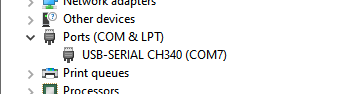

# ESP32-CAM

About ESP32-CAM with ESP32-CAM-MB

# Architecture

- ESP32-CAM Schema

  
  From https://i0.wp.com/randomnerdtutorials.com/wp-content/uploads/2020/03/ESP32-CAM-pinout-new.png

# Install the ESP32-CAM-MB Drivers for Windows 10

!!! Use with **CH340 IC**

[CH341SER.zip](Images/CH341SER.zip)



## Reference

[Hong Ke Technology - Hong Ke Technology documentation](http://www.hpcba.com/en/latest/index.html)

# Use with Arduino IDE

1. File → Preferences → Additional Boards Manager URLs → Add

   https://dl.espressif.com/dl/package_esp32_index.json

2. Tools → Board → Board Manager → Download → ESP32

   

3. Setting follow this image

   

4. Camera Model select AI_THINKER Model

   ```Arduino
   // Select camera model
   //#define CAMERA_MODEL_WROVER_KIT
   //#define CAMERA_MODEL_ESP_EYE
   //#define CAMERA_MODEL_M5STACK_PSRAM
   //#define CAMERA_MODEL_M5STACK_WIDE
   #define CAMERA_MODEL_AI_THINKER
   ```
